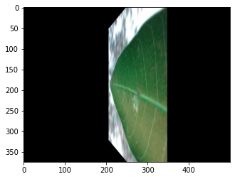
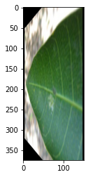

# Pest_Classification_in_Mango_Farms

## step 0:
download the data with the command: !wget https://dphi-live.s3.eu-west-1.amazonaws.com/dataset/mangopests_dataset.zip
and then unzip the file: !7z x mangopests_dataset.zip -o/content/mangopests_dataset
(optional) you can then run !rm mangopests_dataset.zip to remove the .zip file since we don't need it any more and it's about 5GB

## step 1:
data preprocessing :
  as you can see from the following image the data contains a lot of images with black pixels on each side. 
  So the first step is to remove them 
  
  
  
  and here is what the result looks like 
  
  
  
  
  ## step 2:
  the following is very basic preparation to use flow_from_directory and prepare for training
  
  ## step 3:
  first remove GPU if you have already installed cuda and it's yout default tensorflow device and it doesn't have enough memory to hold the model and the batch 
  Then after defining the model, train the top Dense layers 
  Following that reduce the learning rate parameter, this is very important!!! And fine tune the VGG19 weights to fit more our data
  
  ## step 4:
  predict on test set
  
  > the model got 94% accuracy on the test set :)
